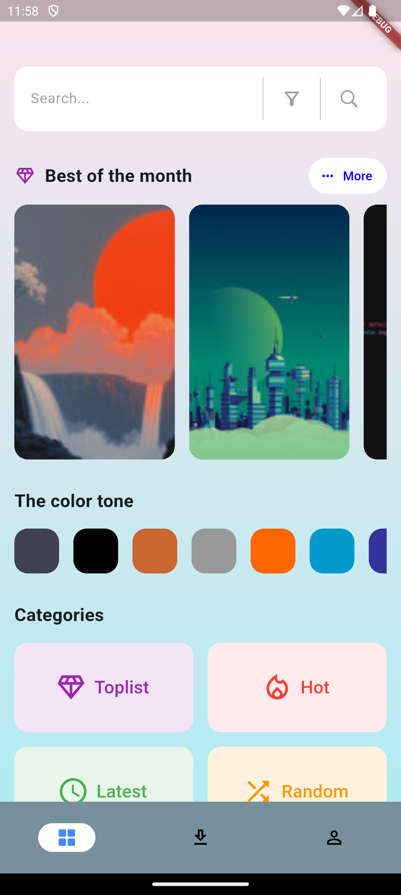
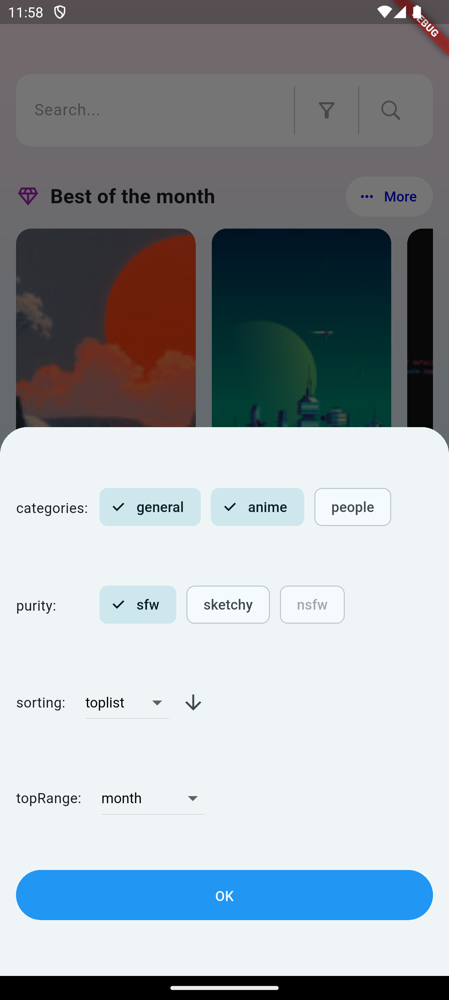
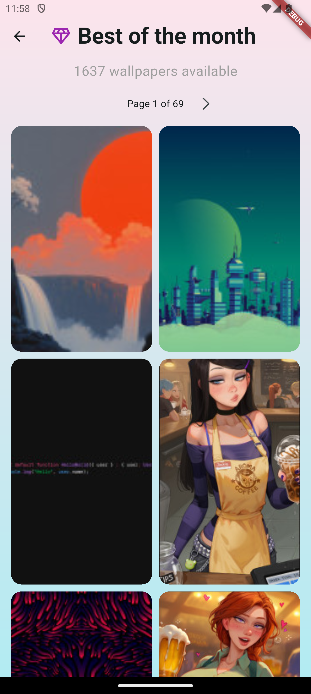
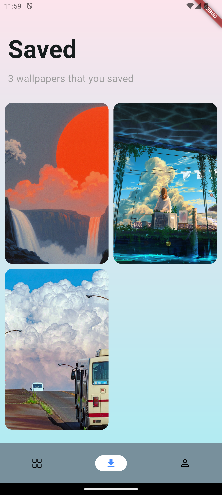

# Haven App

This is an experiment with [wallhaven](https://wallhaven.cc/) api made with Flutter.

## Getting Started

A few resources to get you started in this project:

- [wallhaven FAQ](https://wallhaven.cc/faq)
- [wallhaven API v1 Documentation](https://wallhaven.cc/help/api)
- [dribbble - Wallpaper app by  Rian for SLAB Design Studio](https://dribbble.com/shots/14808564-Wallpaper-app)
- [GetX Pattern](https://kauemurakami.github.io/getx_pattern)

For help getting started with Flutter development, view the
[online documentation](https://docs.flutter.dev/), which offers tutorials,
samples, guidance on mobile development, and a full API reference.

## Screenshots

### Android

|                    Home Page                    |                    Wallpaper Page                    |                    Wallpaper Page - Info                    |                    Like Page                    |                    Save Page                    |
| ------------------------------------------------ | ---------------------------------------------------- | ------------------------------------------------ | ------------------------------------------------------- | ---------------------------------------------------- |
||||||
